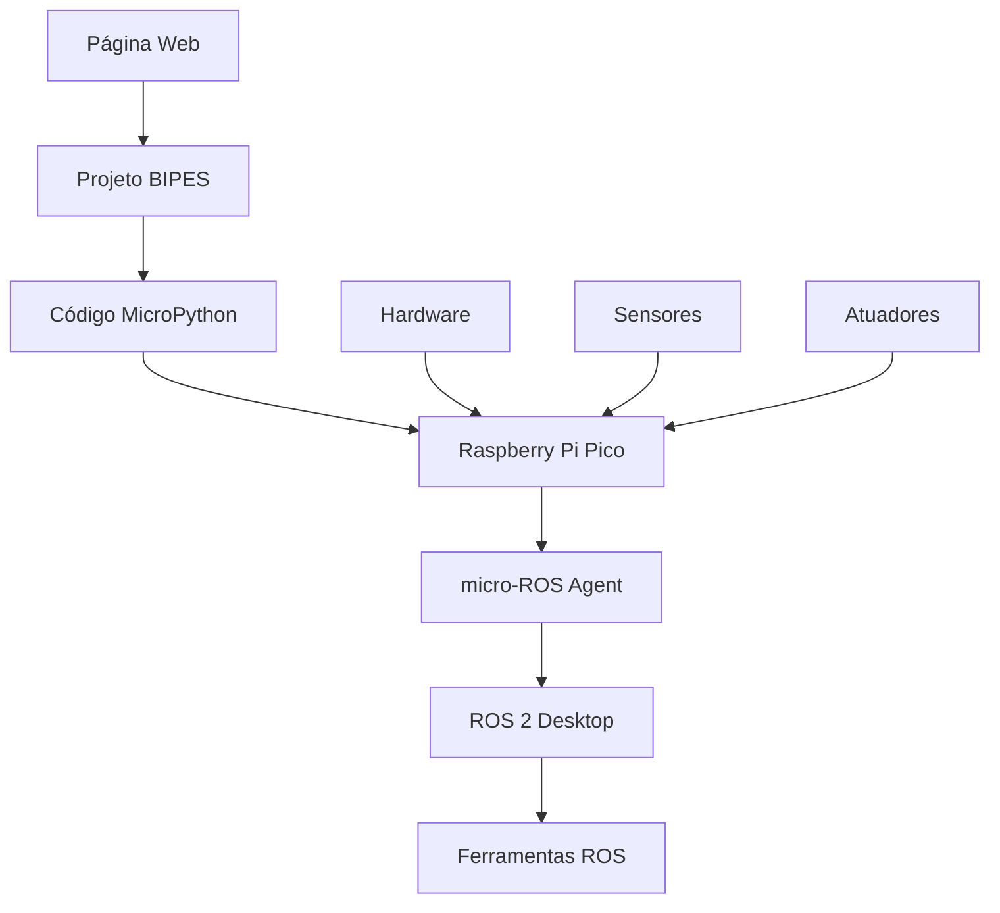

# 🎓 Workflow Educacional Completo

## 🌟 Visão Geral da Experiência do Estudante

Esta documentação descreve a jornada completa do estudante através da plataforma de robótica educacional, desde o primeiro contato até projetos avançados.

## 📚 Jornada do Estudante

### 🚀 **Entrada na Plataforma**
1. **Acesso**: Estudante acessa página web
2. **Orientação**: Sistema explica estrutura de 5 níveis
3. **Diagnóstico**: Questionário rápido determina nível inicial
4. **Onboarding**: Tutorial interativo sobre navegação

### 📖 **Progressão por Níveis**

#### **Nível 1: Fundamentos (2-3 horas)**
```
Estudante → Lê teoria → Vê lista materiais → Monta circuito → 
Acessa BIPES → Programa visualmente → Testa hardware → 
Resolve problemas → Marca como concluído
```

**Exemplo: Controle via Ponte H**
1. 📖 **Leitura**: "O que é uma ponte H?"
2. 🔧 **Materiais**: Lista de compras específica
3. 🔌 **Montagem**: Diagrama Fritzing interativo
4. 💻 **Programação**: Link direto para projeto BIPES
5. ⚡ **Teste**: Checklist de verificação
6. 🆘 **Suporte**: FAQ e troubleshooting
7. ✅ **Conclusão**: Validação e próximo passo

#### **Progressão Automática**
- Sistema detecta conclusão
- Libera próximo nível automaticamente
- Mostra progresso visual na barra superior
- Sugere próxima atividade

### 🎯 **Sistema de Gamificação (Futuro)**

#### Badges e Conquistas
- 🥉 **Bronze**: Conclusão de nível
- 🥈 **Prata**: Sem ajuda/troubleshooting
- 🥇 **Ouro**: Implementação criativa
- 💎 **Diamante**: Contribuição para comunidade

#### Progresso Visual
```
🟢●●●● Nível 1 Completo (100%)
🟡●●○○ Nível 2 Em Progresso (60%)
⚫○○○○ Nível 3 Bloqueado
⚫○○○○ Nível 4 Bloqueado  
⚫○○○○ Nível 5 Bloqueado
```

## 🔄 Fluxo Técnico Completo

### **Integração BIPES → ROS**


### **Exemplo: Sensor de Temperatura IoT**

#### **1. Página Web**
- Estudante clica "🌡️ Sensor de temperatura IoT"
- Lê descrição e conceitos
- Verifica lista de materiais
- Clica "🔗 Abrir no BIPES"

#### **2. Projeto BIPES**
```xml
<!-- Estrutura do projeto BIPES (simplificada) -->
<xml>
  <!-- Inicialização micro-ROS -->
  <block type="microros_init">
    <field name="TRANSPORT">uart</field>
  </block>
  
  <!-- Aguardar agente -->
  <block type="microros_wait_for_agent">
    <field name="TIMEOUT_S">30</field>
  </block>
  
  <!-- Criar nó -->
  <block type="microros_create_node">
    <field name="NODE_NAME">sensor_temp</field>
  </block>
  
  <!-- Publisher temperatura -->
  <block type="microros_create_publisher">
    <field name="TOPIC">/temperatura</field>
    <field name="MSG_TYPE">std_msgs/Float32</field>
  </block>
  
  <!-- Loop principal -->
  <block type="controls_whileUntil">
    <!-- Ler sensor -->
    <!-- Publicar dado -->
    <!-- Spin once -->
    <!-- Delay -->
  </block>
</xml>
```

#### **3. Código Gerado**
```python
import microros
import machine
import time

# Configuração micro-ROS
microros.init('uart')
microros.wait_for_agent(30)

# Criar nó e publisher
node = microros.create_node('sensor_temp')
pub_temp = microros.create_publisher('/temperatura', 'std_msgs/Float32')

# Configurar sensor (exemplo ADC)
sensor = machine.ADC(0)

# Loop principal
while True:
    # Ler temperatura
    raw = sensor.read_u16()
    temp = (raw * 3.3 / 65535 - 0.5) * 100  # Conversão exemplo
    
    # Criar mensagem
    msg = microros.create_float32(temp)
    
    # Publicar
    microros.publish(pub_temp, msg)
    
    # Processar mensagens
    microros.spin_once()
    
    # Aguardar próxima leitura
    time.sleep(2)
```

#### **4. Execução no Hardware**
```bash
# Terminal 1: Agente micro-ROS
ros2 run micro_ros_agent micro_ros_agent serial --dev /dev/ttyUSB0

# Terminal 2: Monitorar dados
ros2 topic echo /temperatura

# Terminal 3: Visualizar (opcional)
ros2 run plotjuggler plotjuggler
```

#### **5. Validação e Próximos Passos**
- Dados aparecendo no `ros2 topic echo`?
- Frequência está correta (2 segundos)?
- Valores fazem sentido?
- **✅ Sucesso** → Liberar próxima atividade

## 🛠️ Infraestrutura de Suporte

### **Sistema de Troubleshooting Inteligente**

#### **Diagnóstico Automático**
```javascript
class DiagnosticSystem {
    static checkCommonIssues() {
        const issues = [];
        
        // Verificar hardware
        if (!this.detectSerialPort()) {
            issues.push({
                type: 'hardware',
                message: 'Pico não detectado',
                solution: 'Verificar cabo USB e drivers'
            });
        }
        
        // Verificar ROS
        if (!this.checkROSAgent()) {
            issues.push({
                type: 'software', 
                message: 'Agente micro-ROS não está rodando',
                solution: 'ros2 run micro_ros_agent micro_ros_agent serial --dev /dev/ttyUSB0'
            });
        }
        
        return issues;
    }
}
```

#### **FAQ Contextual**
- **"Não vejo nada no ros2 topic echo"**
  - ✅ Agente está rodando?
  - ✅ Código foi carregado no Pico?
  - ✅ Cabo USB está conectado?
  - ✅ Aguardou agente conectar?

- **"Erro ao compilar código"**
  - ✅ Firmware micro-ROS instalado?
  - ✅ Versão correta do BIPES?
  - ✅ Todas as dependências instaladas?

### **Sistema de Feedback**
```javascript
// Coleta de feedback automático
class FeedbackSystem {
    static collectUsageData() {
        return {
            timeSpent: this.getTimeOnPage(),
            stepsCompleted: this.getCompletedSteps(),
            errorsEncountered: this.getErrorLog(),
            helpUsed: this.getHelpViews(),
            satisfaction: this.getUserRating()
        };
    }
    
    static sendAnonymousMetrics() {
        // Enviar dados para analytics
        // Melhorar experiência baseado em dados reais
    }
}
```

## 📊 Métricas de Sucesso

### **Métricas Educacionais**
- **Taxa de Conclusão**: % estudantes que completam cada nível
- **Tempo de Aprendizagem**: Tempo médio por nível
- **Taxa de Abandono**: Onde estudantes desistem
- **Pontos de Dificuldade**: Onde mais pedem ajuda

### **Métricas Técnicas**
- **Taxa de Erro**: Problemas técnicos encontrados
- **Performance**: Tempo de carregamento dos projetos
- **Compatibilidade**: Dispositivos e navegadores suportados
- **Disponibilidade**: Uptime dos links BIPES

### **KPIs Principais**
```
🎯 Meta: 80% conclusão Nível 1-3
📊 Atual: Baseline a ser estabelecido
⏱️ Meta: <30min setup por nível
🔧 Meta: <5% problemas técnicos
```

## 🚀 Roadmap de Evolução

### **Fase 1: Base Sólida (Q1 2025)**
- ✅ Página web completa e responsiva
- ✅ Integração BIPES níveis 1-3
- ✅ Documentação abrangente
- ⏳ Testes com usuários piloto

### **Fase 2: Conteúdo Completo (Q2 2025)**
- 🔄 Níveis 4-5 implementados
- 🔄 Sistema de vídeos integrado
- 🔄 Simulador web (Tinkercad/Wokwi)
- 🔄 Comunidade de usuários

### **Fase 3: Experiência Avançada (Q3 2025)**
- 🔮 Gamificação completa
- 🔮 Certificação oficial
- 🔮 Inteligência artificial (chatbot)
- 🔮 Realidade aumentada (montagem)

### **Fase 4: Escala e Impacto (Q4 2025)**
- 🔮 Integração com LMS (Moodle, Canvas)
- 🔮 Versão para professores
- 🔮 Analytics avançados
- 🔮 Internacionalização

## 🎓 Impacto Educacional Esperado

### **Estudantes**
- **Aprendizagem Prática**: Robótica real, não simulação
- **Progressão Natural**: Do básico ao avançado
- **Autonomia**: Aprender no próprio ritmo
- **Motivação**: Gamificação e projetos interessantes

### **Professores**
- **Currículo Pronto**: Conteúdo estruturado
- **Material Didático**: Documentação completa
- **Suporte Técnico**: FAQ e troubleshooting
- **Flexibilidade**: Adaptável a diferentes cursos

### **Instituições**
- **Modernização**: Tecnologia atual (ROS 2)
- **Custo-Benefício**: Hardware acessível
- **Escalabilidade**: Múltiplas turmas simultaneamente
- **Diferenciação**: Inovação educacional

## 🌍 Visão de Futuro

### **Democratização da Robótica**
> "Tornar a robótica avançada acessível a qualquer estudante, independente de recursos ou localização geográfica."

### **Ecossistema Completo**
- **Hardware**: Kits padronizados e acessíveis
- **Software**: Plataforma educacional integrada
- **Conteúdo**: Currículo progressivo e atualizado
- **Comunidade**: Estudantes, professores e profissionais
- **Certificação**: Reconhecimento oficial das competências

### **Impacto Mensurável**
- 📈 **10.000+ estudantes** utilizando a plataforma
- 🏫 **100+ instituições** adotando o currículo
- 🤖 **1.000+ robôs** construídos pelos estudantes
- 💼 **Empregabilidade** aumentada em 40%
- 🌟 **Inovação** em projetos finais dos cursos

---

**🚀 Construindo o futuro da educação em robótica: visual, prático, acessível e inspirador!**
